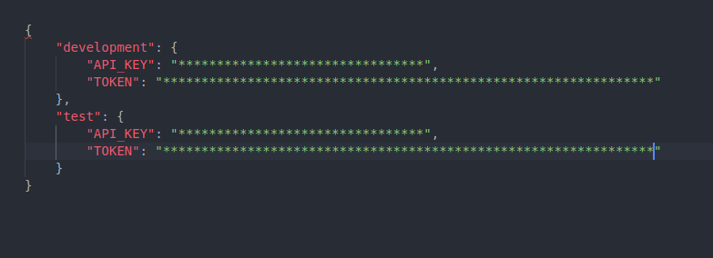

# Trello card using Trello API

This is a front end project mocking the functionality of the Trello application, using the Trello API.

## To set-up the application follow these steps:

1. Clone the repository 
2. Go to the working directory in your terminal
3. Install required dependencies using "npm i"
4. In the "src/js/config" directory, create a "config.json" file and add API_KEY and TOKEN (from https://developers.trello.com/)
)
5. Use "npm run dev" to run the application in your localhost.